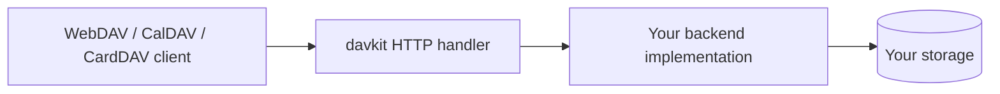
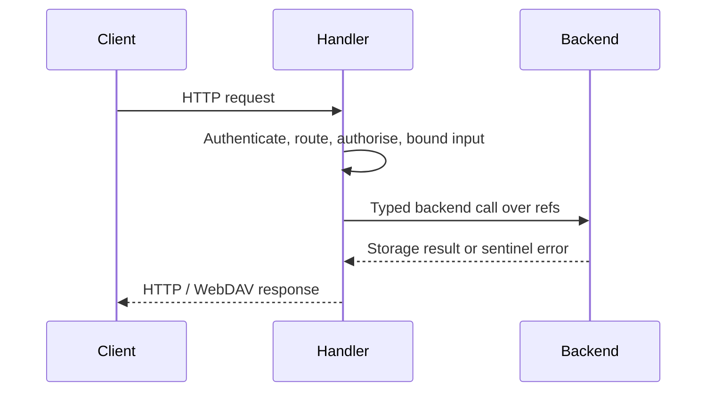

# davkit

[](https://pkg.go.dev/github.com/mniehe/davkit)

`davkit` is a Go library for building [WebDAV], [CalDAV] and [CardDAV]
servers, and for talking to WebDAV servers as a client. It is a library, not a
complete server: your application owns authentication, routing, persistence and
authorisation, and supplies storage by implementing the backend interfaces.

The CalDAV and CardDAV server packages are built on a ref-based backend
contract, described below; the base WebDAV client and server are the lower-level
plumbing beneath them.



## Packages

- `github.com/mniehe/davkit` — WebDAV handlers, a WebDAV client, and
  `LocalFileSystem`, a filesystem-backed server backend.
- `github.com/mniehe/davkit/caldav` — a CalDAV server. Implement its
  `Backend` interface to store calendars and iCalendar objects.
- `github.com/mniehe/davkit/carddav` — a CardDAV server, mirroring `caldav`
  for address books and vCards.
- `github.com/mniehe/davkit/caldavmem`, `.../carddavmem` — in-memory
  reference backends, useful as a starting point and for tests.

The CalDAV and CardDAV packages are servers only; the WebDAV client in the root
package is the sole client here.

## The backend contract

The old backend interface leaked protocol into storage: it handed backends URL
paths, ETags, sync tokens and filter expressions, so neither the library nor a
backend could be tested against its own promise. The rebuild moves that seam.

**Backends speak storage, never protocol.** No backend method takes or returns
a URL path. A backend deals in validated refs (`CalendarRef`, `ItemRef`), item
bytes, revisions and preconditions. The library owns everything protocol-shaped
— URL routing, ETags, sync tokens, filter matching, RFC 3744 privileges, the
XML on the wire — and never asks a backend about any of it.

**`Backend` is a read-only server; every mutation is optional.** The required
interface is an `Authorizer` plus four readers (`ListCalendars`, `GetCalendar`,
`GetItem`, `ListItems`). Everything else is a separate interface the handler
type-asserts for at dispatch, so a backend implements only what it supports:

| Capability | CalDAV interface | CardDAV interface |
|---|---|---|
| Create / replace / delete items | `ItemWriter` | `ItemWriter` |
| Incremental sync (`sync-collection`) | `SyncBackend` | `SyncBackend` |
| Create collections | `CalendarCreator` | `BookCreator` |
| Update collection settings | `CalendarUpdater` | `BookUpdater` |
| Delete collections | `CalendarDeleter` | `BookDeleter` |
| Report who a collection is shared with | `SharingBackend` | `SharingBackend` |
| Atomic COPY / MOVE | `ItemTransferer` | `ItemTransferer` |

When a capability is absent the handler declines the corresponding method with
`405 Method Not Allowed` (and leaves it out of the `Allow` header and the
advertised report and privilege sets), so an existing backend keeps working
when a new capability is added.

**Authorisation is domain permissions, not privileges.** An `Authorizer`
answers what an actor may do in the application's own vocabulary
(`CalendarPermissions`, `AccountPermissions`), and the library maps that onto
RFC 3744 privileges. The zero value denies everything, so a case you forget to
handle is refused rather than allowed. By default a denial is concealed as
`404` (`ConcealDenied`), so a client cannot probe URLs to learn what exists;
choose `RevealDenied` for a `403` where every actor is already trusted to know
what is there.

**One version concept.** `Revision` is a `uint64` that must only ever increase
within a collection; every ETag and sync token the client caches is derived
from it. A `CalendarID` / `BookID` is a never-reused incarnation identity that
scopes every validator, so deleting a collection and recreating one at the same
name invalidates stale ETags and sync positions rather than silently reusing
them.

**Preconditions are opaque and transactional.** The library builds a
`Preconditions` value from the request's conditional headers; the backend calls
`Check` on the state it just read, inside its own transaction. That transaction
is the only place the compare-and-mutate, the ContentID uniqueness check and the
durable change-log append can be made atomic, which is why they are the
backend's job and not the library's.

The interface documentation is the specification of record — every type and
method in `caldav` and `carddav` carries its contract in its doc comment. Start
at `caldav.Backend`.

## WebDAV server

For a local-directory server, attach `webdav.Handler` to Go's standard HTTP
server:

```go
package main

import (
	"log"
	"net/http"

	"github.com/mniehe/davkit"
)

func main() {
	h := &webdav.Handler{
		FileSystem: webdav.LocalFileSystem("./data"),
	}
	log.Fatal(http.ListenAndServe(":8080", h))
}
```

`LocalFileSystem` is useful for a simple server or an example. Production
applications commonly implement `webdav.FileSystem` themselves so that storage
and access checks match their application.

The repository also includes the same minimal server as a runnable example:

```sh
go run ./cmd/webdav-server -addr :8080 ./data
```

## CalDAV server

Build a handler over a `caldav.Backend` with `caldav.NewHandler`. The
`Config` supplies authentication and URL routing; the backend supplies storage.
Authentication runs in `Config.Authenticate`, which turns a request into the
`caldav.Actor` the handler passes to the backend.

```go
store := NewCalendarStore() // implements caldav.Backend (and, for writes,
                            // caldav.ItemWriter, caldav.SyncBackend, ...)

handler, err := caldav.NewHandler(store, caldav.Config{
	Authenticate: func(r *http.Request) (caldav.Actor, error) {
		account, ok := authenticate(r)
		if !ok {
			return caldav.Actor{}, caldav.ErrUnauthorized
		}
		return caldav.Actor{Account: caldav.AccountID(account)}, nil
	},
	WWWAuthenticate: `Basic realm="calendar"`,
	Routes:          caldav.DefaultRoutes("/dav"),
})
if err != nil {
	log.Fatal(err)
}

mux := http.NewServeMux()
mux.Handle("/dav/", handler)
mux.Handle("/.well-known/caldav", handler)

log.Fatal(http.ListenAndServe(":8080", mux))
```

`DefaultRoutes` serves `/<account>/<calendar>/<item>` under the given prefix;
implement `caldav.Routes` yourself for a different URL layout. Either way the
backend never sees a URL — the handler resolves the request path to a
`Resource` before any backend method is called. `/.well-known/caldav` and the
bare root redirect to the authenticated actor's principal, which bootstraps
client discovery.

The CardDAV server has the same shape: `carddav.NewHandler` over a
`carddav.Backend`, with `carddav.DefaultRoutes` and the `/.well-known/carddav`
redirect. `cmd/caldav-server` runs both protocols over the in-memory backends
for manual client testing:

```sh
go run ./cmd/caldav-server -addr :8080
```

## WebDAV client

Create a client with an endpoint, then use filesystem-like operations such as
`Stat`, `Open`, `ReadDir`, `Create`, `Mkdir`, `Copy` and `Move`.

```go
package main

import (
	"context"
	"fmt"
	"log"

	"github.com/mniehe/davkit"
)

func main() {
	client, err := webdav.NewClient(nil, "https://dav.example.com/files/")
	if err != nil {
		log.Fatal(err)
	}

	info, err := client.Stat(context.Background(), "/notes/today.md")
	if err != nil {
		log.Fatal(err)
	}
	fmt.Println(info.Size)
}
```

Pass `webdav.HTTPClientWithBasicAuth` when the server uses HTTP Basic
authentication. For other schemes, pass an `HTTPClient` that adds the required
request headers or transport behaviour.

## Request handling and limits

The handlers validate and canonicalise request paths before they reach a
backend, reject encoded path separators, and confine REPORT-supplied child
hrefs to the requested collection. XML request bodies and their nesting depth
are bounded, calendar and address object `PUT` bodies are limited, recurrence
expansion is bounded, and a single request may only materialise so much of one
collection before it is refused with `507 Insufficient Storage`.



A `caldav` or `carddav` backend reports outcomes through the package's sentinel
errors and typed errors — `ErrNotFound`, `ErrPreconditionFailed`,
`ErrForbidden`, `*DuplicateContentIDError`, and so on — which the handler maps
to HTTP status. A `webdav.FileSystem` backend chooses a status with
`webdav.NewHTTPError`. In both cases an unrecognised backend error becomes a
generic `5xx`, so implementation detail is not sent to clients.

## Scope

This library targets the CalDAV and CardDAV surface that ordinary clients use.
Scheduling (RFC 6638), WebDAV `LOCK`/`UNLOCK`, arbitrary dead properties and the
`DAV:acl` property are not implemented.

## Development

The module requires Go 1.27 or later.

```sh
go test ./...
go vet ./...
go build ./...
gofmt -l .
```

## License

Copyright (C) 2026 Mark Niehe. Licensed under the GNU Affero General Public
License v3.0 or later ([AGPL-3.0-or-later](LICENSE)) — running a modified version
to serve users over a network obliges you to offer them its source.

[WebDAV]: https://www.rfc-editor.org/rfc/rfc4918
[CalDAV]: https://www.rfc-editor.org/rfc/rfc4791
[CardDAV]: https://www.rfc-editor.org/rfc/rfc6352
